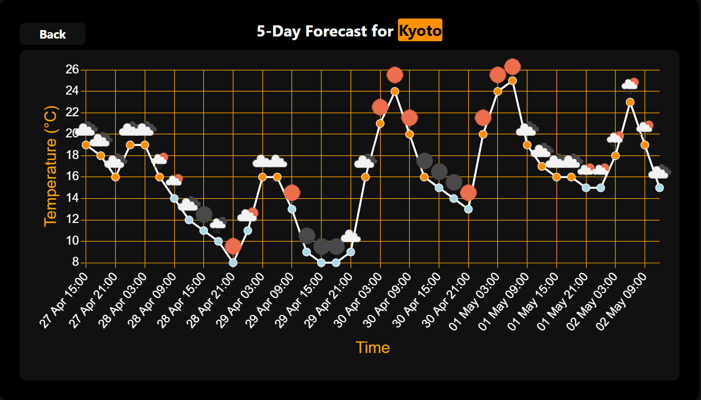

# Weather App
This is a weather web application built using **FastAPI** that provides real-time weather data and weather forecasts for a given city. The application integrates with the **OpenWeather API** to fetch weather data and provides an interface for users to search for the current weather and forecast by entering the city name or using geolocation coordinates.
## Screenshots
### Current Weather Page

### Weather Forecast Page

### Error Page

## Features
- View current weather data for a specific city.
- View weather forecast (for the next 5 days) for a specific city.
- Option to get weather information based on geographic coordinates (latitude and longitude).
- Error handling for invalid city names and API issues.
- An elegant, responsive, user-friendly and familiar interface with an error page for invalid data entry.
## Technologies Used
- **FastAPI** - Web framework for building the API.
- **Jinja2** - Templating engine for rendering HTML.
- **httpx** — For making asynchronous HTTP requests to the OpenWeather API.
- **Geopy** - For reverse geocoding (converting coordinates to city names).
- **OpenWeather API** - Provides weather data.
## Requirements
- Python 3.7 or higher
- Install dependencies with pip:
```bash
pip install -r requirements.txt
```
## Setup
Before running the application, you need to create a `config.py` file in the root of the project directory. This file will contain your personal API key for accessing the weather data.

### Steps to create `config.py`:

1. Create a new file named `config.py` in the root directory of the project.

2. Add the following content to `config.py`:

```python
API_KEY = 'your_api_key_here'
BASE_URL = 'http://api.openweathermap.org/data/2.5'
```
3. Replace your_api_key_here with your actual API key from [OpenWeatherMap](https://openweathermap.org/). Make sure to keep the config.py file private, as it contains your API key.

4. Run the application:
```bash
uvicorn main:app --reload
```
The app will be running on http://localhost:8000.

## Usage
- Home Page: The home page allows users to enter a city name and select the type of weather view (current weather or forecast).

- Weather Page: Displays the current weather or weather forecast for the entered city.

- Auto Weather Page: Use this route by providing latitude and longitude to fetch the weather based on geolocation coordinates.

## Error Handling
The application includes global error handling for:
- Invalid city names (404 error).
- Validation errors (400 error).
- Unexpected server errors (500 error).

When an error occurs, users are presented with an error page showing the error code and message.
## Folder Structure
```graphql
root/
│
├── config.py           # Contains sensitive API key 
├── main.py             # FastAPI app configuration
├── core/
│   └── api.py          # API communication and geocoding functions
│
├── controllers/
│   └── weather_controller.py  # Logic for fetching weather data
│
├── models/
│   └── weather.py      # Pydantic models for weather data
│
├── routes/
│   └── app_routes.py   # API routes for weather and pages
│
├── static/
│   ├── styles/         # CSS files
│   │   └── style.css
│   ├── templates/      # HTML templates
│   │   ├── base.html
│   │   ├── current.html
│   │   ├── error.html
│   │   └── forecast.html
│   └── favicon.ico
│
└── views/
    └── weather_view.py # Logic for rendering weather-related templates
```
## License
This project is licensed under the MIT License - see the [LICENSE](LICENSE) file for details.
## Author
[Dain Atreides](https://github.com/DainAtreides)
